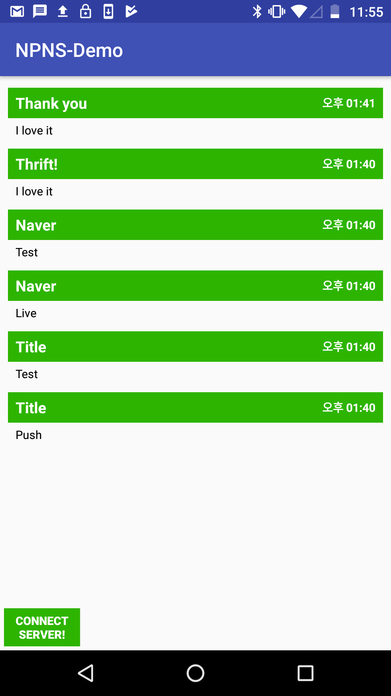

# NPNS
Naver Push Notification Serveice 

### 개요
* FCM, APNS등 Cloud기반의 Message Service를 사용하지 않고 직접 푸쉬서비스를 구현하는것이 목적

### 기술스택
* 서버 - Spring Framework
* 클라이언트  - Android
* 통신 인터페이스 정의(IDL) - Apache Thrift
* 데이터베이스 - MariaDB

### 핵심 기능
1. 서비스에 등록된 모든 이용자에게 푸쉬메세지 전송 (Broadcast)
2. 서비스에 등록된 특정 이용자에게 푸쉬메세지 전송 (Unicast)

### 참고사항
* 서버를 구축하는 코드는 NPNS_server repo에 있음
* Thrift기반 Push Service 기준에서 Android Client는 Push Message 를 받는 주체이다. 따라서 전체코드에서 Thrift 부분은 Thrift Server를 구현하는 코드가 작성되어 있다. "ServerRunTask.class" 참고

### 실행화면

### 실행동영상
https://drive.google.com/open?id=1NY8NCDHixZsrDcupgOstPndFcN_7JKvA
